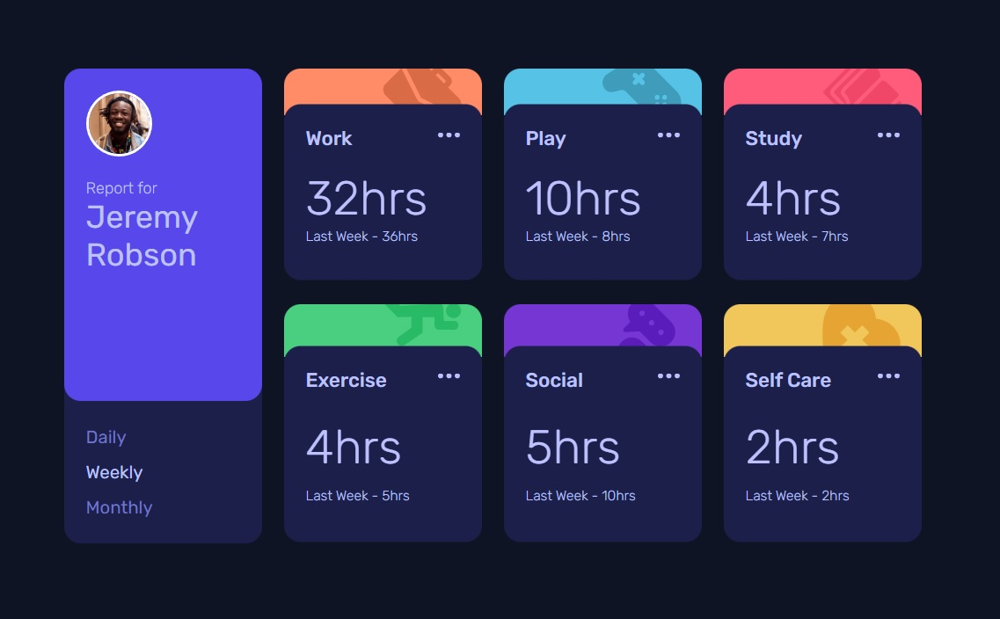

# Frontend Mentor - Time tracking dashboard solution

This is a solution to the [Time tracking dashboard challenge on Frontend Mentor](https://www.frontendmentor.io/challenges/time-tracking-dashboard-UIQ7167Jw). Frontend Mentor challenges help you improve your coding skills by building realistic projects.

## Table of contents

- [Overview](#overview)
  - [The challenge](#the-challenge)
  - [Screenshot](#screenshot)
  - [Links](#links)
- [My process](#my-process)
  - [Built with](#built-with)
  - [What I learned](#what-i-learned)
- [Author](#author)
- [Acknowledgments](#acknowledgments)

## Overview

### The challenge

Users should be able to:

- View the optimal layout for the site depending on their device's screen size
- See hover states for all interactive elements on the page
- Switch between viewing Daily, Weekly, and Monthly stats

### Screenshot



### Links

- Solution URL: [GitHub](https://github.com/lazo2212/Time_tracking_dashboard)
- Live Site URL: [Time Tracking Dashboard - live](https://lazo2212.github.io/Time_tracking_dashboard/)

## My process

### Built with

- Semantic HTML5 markup
- CSS custom properties
- Flexbox
- CSS Grid
- Mobile-first workflow
  styles

### What I learned

In this project I got the opportunity to work with a JSON file from which I could pull data and use it for this project.

Pull data from JSON:

```js
const fetchData = async () => {
  const data = await fetch('./data.json')
    .then((response) => response.json())
    .then((data) => data);
  return data;
};
```

And then use data:

```js
fetchData().then((dataArray) => {
  dataArray.forEach((element) => {
    createActionContainers(element, element.timeframes.weekly);
  });
});
```

## Author

- LinkedIN - [Robert Lazić](https://www.linkedin.com/in/robert-lazi%C4%87/)
- GitHub - [Robert Lazić](https://github.com/lazo2212)
- Frontend Mentor - [Robert](https://www.frontendmentor.io/profile/lazo2212)
- email - robert.lazicpz@gmail.com

## Acknowledgments

I would like to thank the Frontend Mentor site and its team for creating excellent tasks and challenges where we can practice and improve our programming skills.
